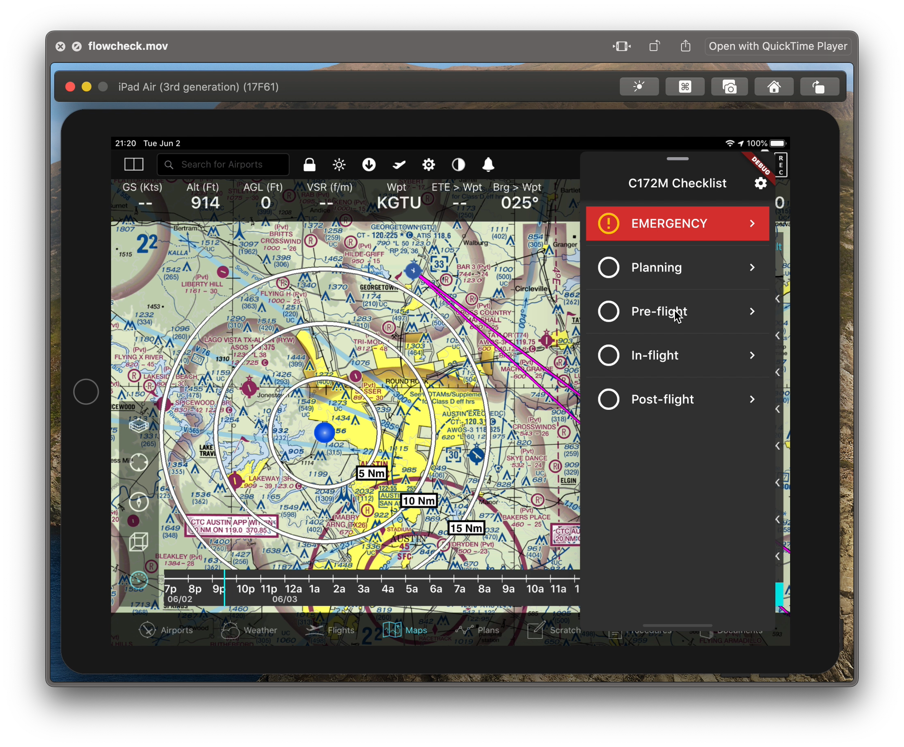

# "Flowcheck"

> Work in progress!

This is a prototype Flutter iOS application for an aircraft (Cessna 172M) checklist. It is designed to be used in light
GA aircraft which are typically tossed around in turbulence. User touch/tap input is intentionally constrained, and
speech feedback is heavily leveraged. It can be setup to overlay EFBs as a "Slide Over" window.

[Play the video recording.](https://youtu.be/wlN8Wxjxk40)
