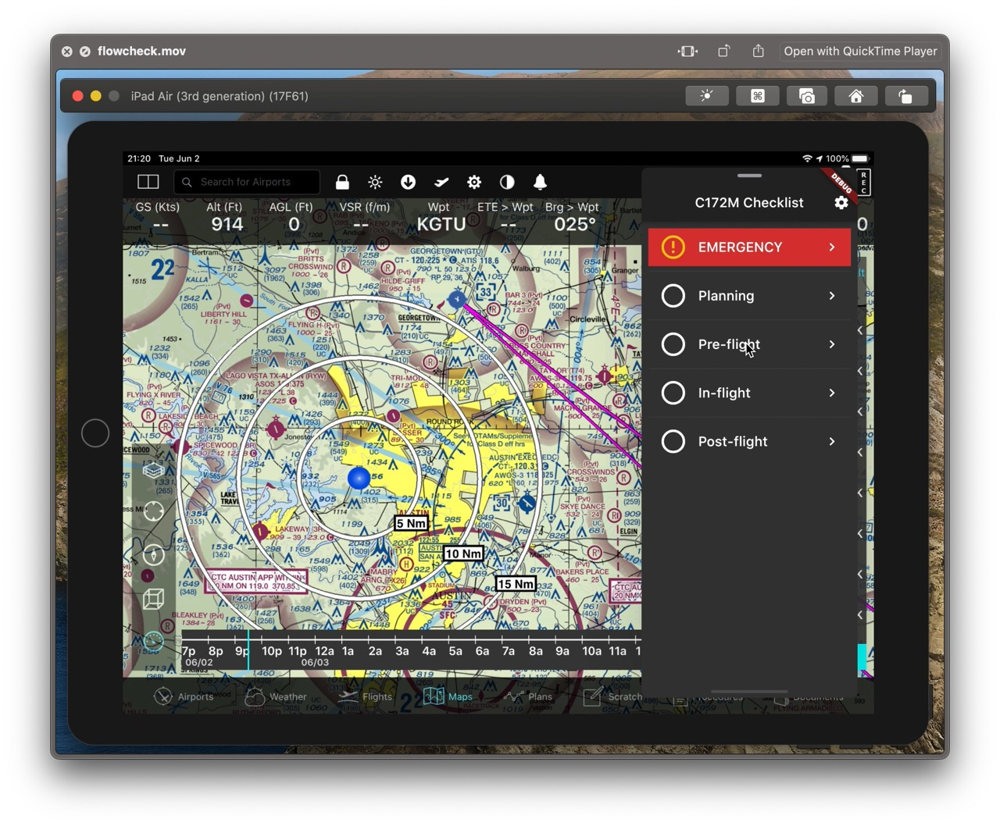

# "Flowcheck"

> Work in progress!

This is a prototype Cessna 172M checklist written in Flutter. The UIUX is designed for light GA aircraft which are typically tossed around in turbulence. User touch/tap input is intentionally oversized and constrained, and speech feedback is heavily leveraged. It can be setup to overlay EFBs as a "Slide Over" window.

[Play video recording.](https://youtu.be/wlN8Wxjxk40)
